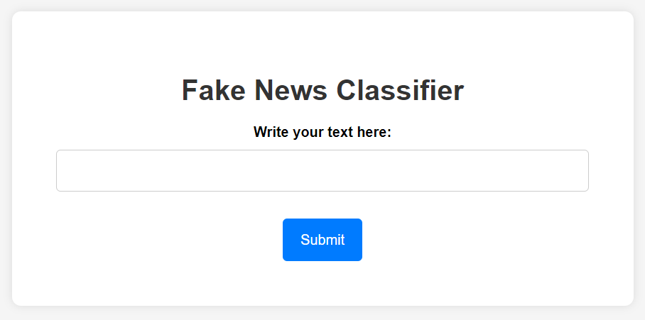
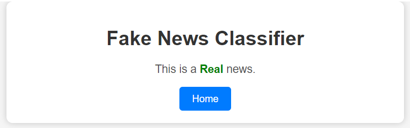
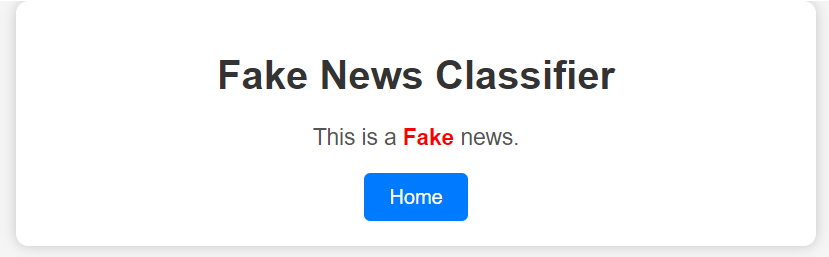

# Fake News Classifier NLP Project

Welcome to the Fake News Classifier NLP Project repository. This project is designed to classify news articles as either "REAL" or "FAKE" using Natural Language Processing techniques.

## Project Structure

The repository contains the following files and directories:

- **`news.csv`**: This dataset contains news articles with columns for index, title, text, and label. The label column has two values, "REAL" and "FAKE."

- **`notebook.ipynb`**: This Jupyter Notebook contains the code for data preprocessing, feature extraction, model training, and evaluation. It uses libraries such as NumPy, Pandas, Matplotlib, Seaborn, Scikit-learn, and NLTK.

- **`app.py`**: This is the Flask web application that allows users to input text and classify it as "REAL" or "FAKE."

- **`templates` directory**: This directory contains the HTML templates for the web app, including `index.html`, `real.html`, and `fake.html`.

## Data Preprocessing

In the `notebook.ipynb` notebook, we perform the following data preprocessing steps:

1. Load the dataset from `news.csv`.
2. Remove unwanted columns, keeping only the "text" and "label" columns.
3. Map "REAL" as 1 and "FAKE" as 0 in the label column.
4. Perform text preprocessing, which includes removing symbols and numeric characters, removing stop words, and applying lemmatization.
5. Convert words into vectors using the Count Vectorizer technique with hyperparameter tuning, setting `ngram_range` to (2,3).

## Model Training and Evaluation

In the notebook, we train multiple models, including Multinomial Naive Bayes, Logistic Regression, Random Forest Classifier, Support Vector Classifier (SVC), and Gradient Boosting. We evaluate each model using confusion matrices and classification reports.

The Multinomial Naive Bayes model performed the best with the following metrics:
- Precision: 0.93
- Recall: 0.92
- F1-score: 0.93

We saved the Multinomial Naive Bayes model as `model.pkl` and the Count Vectorizer as `vectorizer.pkl` using the Pickle library.

## Flask Web App

The Flask web application (`app.py`) provides a user-friendly interface for classifying news articles. Users can input text, and the app will predict whether the news is "REAL" or "FAKE" based on the trained model. It utilizes the saved model (`model.pkl`) and Count Vectorizer (`vectorizer.pkl`) for classification.

## How to Use the Web App

1. Make sure you have Flask and the required libraries installed. You can install them using `pip`:

   ```bash
   pip install -r requirements.txt
   ```

2. Run the Flask app by executing the following command:

   ```bash
   python app.py
   ```

3. Access the web app in your web browser by going to `http://localhost:5000`.

4. Enter a news article's text in the provided text box and click the "Submit" button to see the prediction.

Feel free to reach out if you have any questions or need further assistance. Enjoy your cat-dog classification project!

## Webpage Glimpse:



